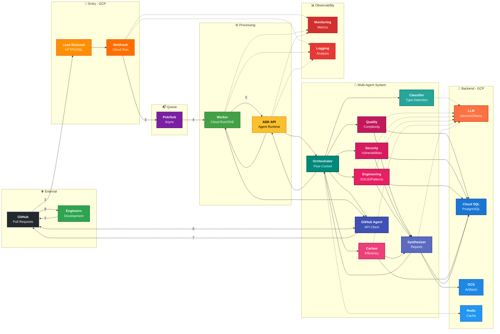
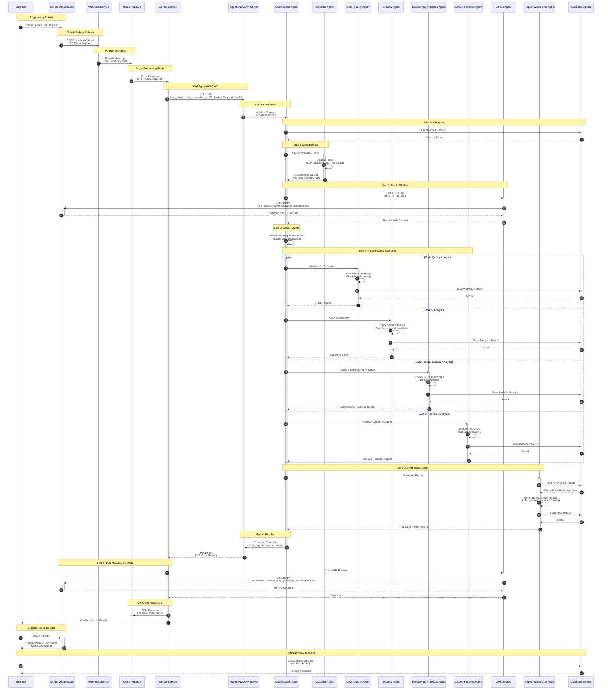

# GitHub Integration Architecture

## System Architecture Diagram

```mermaid
graph LR
    subgraph External["🌐 External"]
        GH["<b>GitHub</b><br/>Pull Requests"]
        ENG["<b>Engineers</b><br/>Development"]
        style GH fill:#24292e,stroke:#ffffff,stroke-width:2px,color:#ffffff
        style ENG fill:#2ea44f,stroke:#1b7f37,stroke-width:2px,color:#ffffff
    end

    subgraph Entry["🚪 Entry - GCP"]
        LB["<b>Load Balancer</b><br/>HTTPS/SSL"]
        WH["<b>Webhook</b><br/>Cloud Run"]
        style WH fill:#ff6f00,stroke:#e65100,stroke-width:2px,color:#ffffff
        style LB fill:#ff8f00,stroke:#e65100,stroke-width:2px,color:#ffffff
    end

    subgraph Queue["📬 Queue"]
        PS["<b>Pub/Sub</b><br/>Async"]
        style PS fill:#7b1fa2,stroke:#4a148c,stroke-width:2px,color:#ffffff
    end

    subgraph Processing["⚙️ Processing"]
        WK["<b>Worker</b><br/>Cloud Run/GKE"]
        API["<b>ADK API</b><br/>Agent Runtime"]
        style WK fill:#43a047,stroke:#2e7d32,stroke-width:2px,color:#ffffff
        style API fill:#fbc02d,stroke:#f57f17,stroke-width:2px,color:#000000
    end

    subgraph Agents["🤖 Multi-Agent System"]
        ORC["<b>Orchestrator</b><br/>Flow Control"]
        CLS["<b>Classifier</b><br/>Type Detection"]
        CQ["<b>Quality</b><br/>Complexity"]
        SEC["<b>Security</b><br/>Vulnerabilities"]
        EP["<b>Engineering</b><br/>SOLID/Patterns"]
        CAR["<b>Carbon</b><br/>Efficiency"]
        GHA["<b>GitHub Agent</b><br/>API Client"]
        RPT["<b>Synthesizer</b><br/>Reports"]
        style ORC fill:#00897b,stroke:#004d40,stroke-width:2px,color:#ffffff
        style CLS fill:#26a69a,stroke:#00695c,stroke-width:2px,color:#ffffff
        style CQ fill:#c2185b,stroke:#880e4f,stroke-width:2px,color:#ffffff
        style SEC fill:#d81b60,stroke:#880e4f,stroke-width:2px,color:#ffffff
        style EP fill:#e91e63,stroke:#880e4f,stroke-width:2px,color:#ffffff
        style CAR fill:#ec407a,stroke:#ad1457,stroke-width:2px,color:#ffffff
        style GHA fill:#3f51b5,stroke:#1a237e,stroke-width:2px,color:#ffffff
        style RPT fill:#5c6bc0,stroke:#283593,stroke-width:2px,color:#ffffff
    end

    subgraph Backend["💾 Backend - GCP"]
        LLM["<b>LLM</b><br/>Gemini/Ollama"]
        DB["<b>Cloud SQL</b><br/>PostgreSQL"]
        ART["<b>GCS</b><br/>Artifacts"]
        CACHE["<b>Redis</b><br/>Cache"]
        style LLM fill:#ff7043,stroke:#bf360c,stroke-width:2px,color:#ffffff
        style DB fill:#1976d2,stroke:#0d47a1,stroke-width:2px,color:#ffffff
        style ART fill:#1e88e5,stroke:#1565c0,stroke-width:2px,color:#ffffff
        style CACHE fill:#2196f3,stroke:#1565c0,stroke-width:2px,color:#ffffff
    end

    subgraph Monitor["📊 Observability"]
        MON["<b>Monitoring</b><br/>Metrics"]
        LOG["<b>Logging</b><br/>Analysis"]
        style MON fill:#d32f2f,stroke:#b71c1c,stroke-width:2px,color:#ffffff
        style LOG fill:#e53935,stroke:#c62828,stroke-width:2px,color:#ffffff
    end

    %% Main Flow (Left to Right)
    ENG -->|1| GH
    GH -->|2| LB --> WH
    WH -->|3| PS
    PS -->|4| WK
    WK -->|5| API --> ORC
    ORC --> CLS
    ORC --> GHA
    GHA <-->|6| GH
    
    %% Agent Orchestration
    ORC --> CQ & SEC & EP & CAR
    CQ & SEC & EP & CAR --> RPT
    RPT --> ORC
    
    %% AI Integration
    CLS -.-> LLM
    CQ & SEC & EP & CAR -.-> LLM
    RPT -.-> LLM
    
    %% Storage
    CQ & SEC & EP & CAR --> DB
    RPT --> DB & ART
    ORC -.-> CACHE
    
    %% Return Path
    ORC --> API --> WK --> GHA
    GHA -->|7| GH -->|8| ENG
    
    %% Monitoring
    WH & WK & API -.-> LOG & MON
```

## Sequence Diagram

```mermaid
sequenceDiagram
    autonumber
    participant SE as Engineer
    participant GH as GitHub Organization
    participant WH as Webhook Service
    participant PS as Cloud Pub/Sub
    participant WK as Worker Service
    participant API as Agent (ADK) API Server
    participant ORC as Orchestrator Agent 
    participant CLS as Classifier Agent
    participant CQ as Code Quality Agent
    participant SEC as Security Agent
    participant EP as Engineering Practices Agent
    participant CAR as Carbon Footprint Agent
    participant GHA as GitHub Agent
    participant RPT as Report Synthesizer Agent
    participant DB as Database Service

    Note over SE,GH: Engineering Activity 
    SE->>GH: Create/Update Pull Request
    activate GH

    Note over GH,WH: Github Webhook Event
    GH->>WH: POST /webhook/github<br/>(PR Event Payload)
    activate GH

    Note over WH,PS: Publish to Queue
    WH->>PS: Publish Message<br/>(PR Event Payload)
    activate PS

    Note over PS,WK: Async Processing Starts
    PS->>WK: Push Message<br/>(PR Review Request)
    activate WK

    Note over WK, API: Call Agent (ADK) API
    WK->>API: POST /run<br/>(app_name, user_id, session_id, PR Review Request details) 
    activate API

    Note over API,ORC: Start Orcestration
    API->>ORC: Initialize Context<br/>(IvocationContext)
    activate ORC

   Note over ORC,DB: Initialize Session
   ORC->>DB: Create/Load Session
   activate DB
   DB-->>ORC: Session Data
   deactivate DB

   Note over ORC,CLS: Step 1 Classification 
   ORC->>CLS: Classify Request Type
   activate CLS
   CLS->>CLS: Analyze Input<br/>(LLM: granite4/ gemini-2.5-flash)
   CLS-->>ORC: Classification Result<br/>(type: code_review_full)
   deactivate CLS

   Note over ORC,GHA: Step 2: Fetch PR Files
   ORC->>GHA: Fetch PR Files<br/>(repo, pr_number)
   activate GHA
   GHA->>GH: GitHub API:<br/>GET /repos/{owner}/pulls/{pr_number}/files
   activate GH
   GH-->>GHA: Changed Files + Patches
   deactivate GH
   GHA-->>ORC: File List With Content
   deactivate GHA

   Note over ORC: Step 3: Select Agents
   ORC->>ORC: Determine Requested Agents<br/>(based on classification)

   Note over ORC,CAR: Step 4: Parallel Agent Execution
   par Code Quality Analysis
        ORC->>CQ: Analyze Code Quality
        activate CQ
        CQ->>CQ: Calculate Complexity<br/>Check Maintainability
        CQ->>DB: Save Analysis Results
        activate DB
        DB-->>CQ: Saved
        deactivate DB
        CQ-->>ORC: Quality Report
        deactivate CQ
   and  Security Analysis
        ORC->>SEC: Analyze Security
        activate SEC
        SEC->>SEC: Check Security Issues<br/>Find Secrets, Vulnerabilities
        SEC->>DB: Save Analysis Results
        activate DB
        DB-->>SEC: Saved
        deactivate DB
        SEC-->>ORC: Security Report
        deactivate SEC
    and Engineering Practices Analysis
        ORC->>EP: Analyze Engineering Practices
        activate EP
        EP->>EP: Check SOLID Principles<br/>Design Patterns
        EP->>DB: Save Analysis Results
        activate DB
        DB-->>EP: Saved
        deactivate DB
        EP-->>ORC: Engineering Practices Report
        deactivate EP
    and Carbon Footprint Analysis
        ORC->>CAR: Analyze Carbon Footprint
        activate CAR
        CAR->>CAR: Analyze Efficiency<br/>Estimate Emissions
        CAR->>DB: Save Analysis Results
        activate DB
        DB-->>CAR: Saved
        deactivate DB
        CAR-->>ORC: Carbon Footprint Report
        deactivate CAR
    end

    Note over ORC,RPT: Step 5: Synthesize Report
    ORC->>RPT: Generate Report
    activate RPT
    RPT->>DB: Read All Analysis Results
    activate DB
    DB-->>RPT: Consolidate Reporting Data
    deactivate DB
    RPT-->>RPT: Generate Markdown Report<br/>(LLM: granite4/ gemini-2.5-flash)
    RPT->>DB: Save Final Report
    activate DB
    DB-->>RPT: Saved
    deactivate DB
    RPT-->>ORC: Final Report (Markdown)
    deactivate RPT
    
    Note over ORC,API:Return Results
    ORC-->>API: Execution Complete<br/>(final_report in session state)
    deactivate ORC
    API-->>WK: Response<br/>(200 OK + Report)
    deactivate API

    Note over WK,GH: Step 6: Post Results to GitHub
    WK->>GHA: Create PR Review
    activate GHA
    GHA->>GH: GitHub API:<br/>POST /repos/{owner}/{repo}/pulls/{pr_number}/reviews
    activate GH 
    GH-->>GHA: Review Created
    deactivate GH
    GHA-->>WK: Success
    deactivate GHA
    
    Note over WK,PS: Complete Processing
    WK->>PS: ACK Message<br/>(Remove from Queue)
    deactivate PS
    WK-->>SE: (Notification via GitHub)
    deactivate WK

    Note over SE,GH: Engineer Sees Results
    SE->>GH: View PR Page
    activate GH
    GH-->>SE: Display Review Comments<br/>& Analysis Report
    deactivate GH

    Note over SE,DB: Optional: View Analytics
    SE->>DB: Query Historical Data<br/>(via Dashboard)
    activate DB
    DB-->>SE: Trends & Metrics
    deactivate DB
```

   

