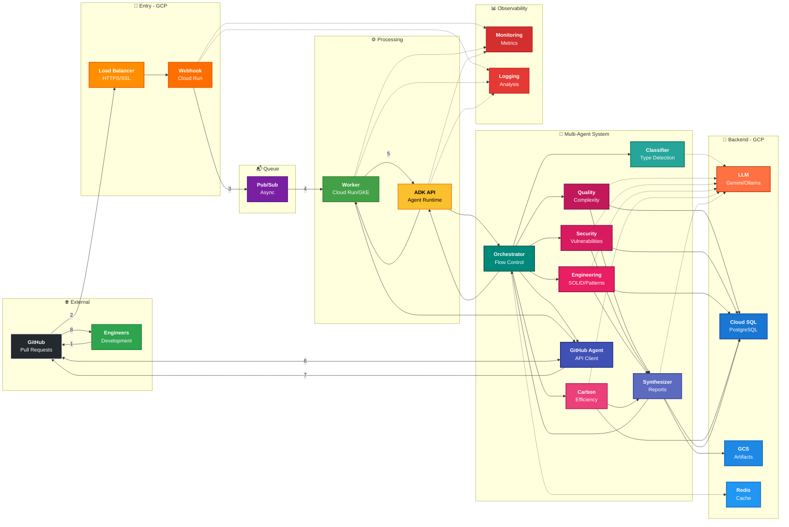
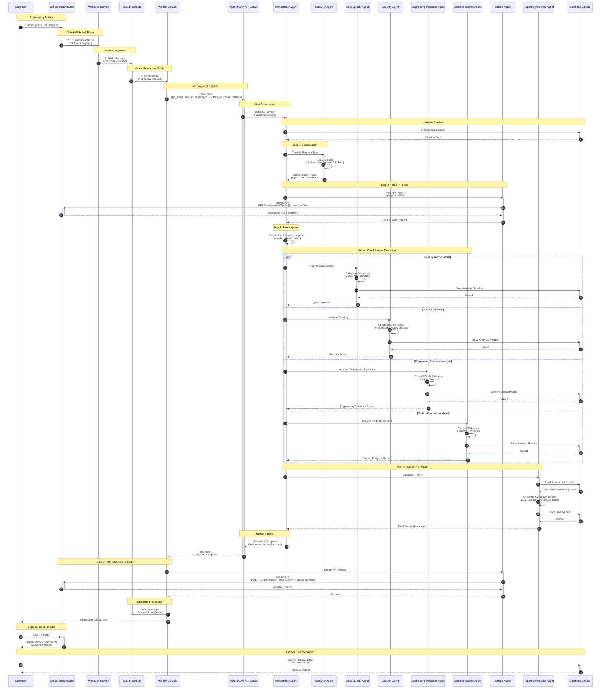

# GitHub Integration Architecture

## System Architecture Diagram



## Sequence Diagram




## End-to-End Workflow

### STEP 1: GITHUB WEBHOOK INTEGRATION

**1. Engineer → GitHub**
   - Creates or updates Pull Request
   - Triggers: opened, synchronize, reopened events

**2. GitHub → Webhook Service (Cloud Run)**
   - POST /webhook/github
   - Payload: PR event data (repo, pr_number, action, sender)

**3. Webhook Service (Cloud Run)**
   - Validates HMAC signature (security)
   - Filters event type (only PR events)
   - Extracts PR metadata
   - Transforms to internal format

**4. Webhook Service → Cloud Pub/Sub**
   - Publishes message to "pr-review-requests" topic
   - Message: {repo, owner, pr_number, pr_title, author, head_sha, action}
   - Returns 200 OK to GitHub (webhook acknowledged)

---

### STEP 2: ASYNC PROCESSING TRIGGER

**5. Cloud Pub/Sub → Worker Service (Cloud Run)**
   - Pushes message from subscription
   - Worker receives: PR review request
   - Retries on failure (exponential backoff)

**6. Worker Service → Agent (ADK) API Server (Cloud Run)**
   - POST /api/v1/run
   - Headers: {Authorization: Bearer <token>}
   - Body: 
     ```json
     {
       "app_name": "orchestrator_agent",
       "user_id": "repo_owner",
       "session_id": "pr_<repo>_<pr_number>",
       "user_message": "Review PR #<number>: <title>",
       "context": {
         "repo": "<owner>/<repo>",
         "pr_number": <number>,
         "head_sha": "<sha>",
         "author": "<username>"
       }
     }
     ```

---

### STEP 3: CODE REVIEW ORCHESTRATION STARTS

**7. Agent API → Orchestrator Agent**
   - Initializes InvocationContext
   - Creates parent agent instance
   - Sets up execution environment

**8. Orchestrator → Session Service**
   - Creates or loads session: "pr_<repo>_<pr_number>"
   - Session stores: {state, history, metadata}
   - Returns: Session data with analysis_history[]

**9. Orchestrator → Cache Service (Redis/Memorystore)**
   - Checks if PR already analyzed (cache key: SHA256 of file contents)
   - If cache HIT: Returns cached report (skip to Step 16)
   - If cache MISS: Proceeds with analysis

---

### STEP 4: CLASSIFICATION & CODE RETRIEVAL

**10. Orchestrator → Classifier Agent**
   - Analyzes request intent: "Review PR_#001: Add payment feature"
   - Classifier → LLM Service (Gemini 2.5 Flash / Ollama Granite4)
   - Returns: {"type": "code_review_full", "has_code": true, "focus_areas": ["security", "quality", "engineering_practices"]}
     

**11. Orchestrator → GitHub Agent**
   - Request: Fetch PR files {repo: "owner/repo", pr_number: 123}
   
**12. GitHub Agent → GitHub API**
   - GET /repos/{owner}/{repo}/pulls/{pr_number}/files
   - Headers: {Authorization: token <github_token>}
   - Returns: Array of changed files with patches

**13. GitHub Agent → Orchestrator**
   - Returns: List of files with content, diffs, status (added/modified/deleted)
   
**14. Orchestrator → Code Optimizer**
   - Strips comments/docstrings from large files (>2000 chars)
   - Reduces token usage by ~20-30%

**15. Orchestrator → Artifact Service (GCS)**
   - Saves code input to: artifacts/orchestrator_agent/{user_id}/inputs/
   - File: code_input_analysis_{timestamp}.{ext}
   - Metadata: code_input_analysis_{timestamp}.{ext}.meta.json

---

### STEP 5: SEQUENTIAL AGENT EXECUTION
> ⚠️ **Sequential (not parallel)** to prevent API rate limiting
> 2-second delays between agents to stay under 15 RPM (Gemini free tier)
> Agents selection informed by Classifier Agent

**16. Orchestrator → Code Quality Agent** (Agent 1/4)
   - Analyzes: Complexity, maintainability, code smells
   - Code Quality Agent → LLM Service
   - Code Quality Agent → Tools: 
     - analyze_code_complexity()
     - analyze_static_code()
     - parse_code_ast()
   - Code Quality Agent → Database (Cloud SQL)
     - Saves analysis to: analysis_results table
   - Code Quality Agent → Artifact Service (GCS)
     - Saves: artifacts/.../sub_agent_outputs/analysis_..._code_quality_agent.json
   - Returns: Quality report to Orchestrator
   - ⏱️ Delay: 2 seconds

**17. Orchestrator → Security Agent** (Agent 2/4)
   - Analyzes: Vulnerabilities, secrets, injection risks
   - Security Agent → LLM Service
   - Security Agent → Tools:
     - scan_security_vulnerabilities()
   - Security Agent → Database (Cloud SQL)
   - Security Agent → Artifact Service (GCS)
   - Returns: Security report to Orchestrator
   - ⏱️ Delay: 2 seconds

**18. Orchestrator → Engineering Practices Agent** (Agent 3/4)
   - Analyzes: SOLID principles, design patterns, best practices
   - Engineering Agent → LLM Service
   - Engineering Agent → Tools:
     - evaluate_engineering_practices()
   - Engineering Agent → Database (Cloud SQL)
   - Engineering Agent → Artifact Service (GCS)
   - Returns: Engineering report to Orchestrator
   - ⏱️ Delay: 2 seconds

**19. Orchestrator → Carbon Footprint Agent** (Agent 4/4)
   - Analyzes: Code efficiency, energy consumption, emissions
   - Carbon Agent → LLM Service
   - Carbon Agent → Tools:
     - analyze_carbon_footprint()
   - Carbon Agent → Database (Cloud SQL)
   - Carbon Agent → Artifact Service (GCS)
   - Returns: Carbon report to Orchestrator

---

### STEP 6: REPORT SYNTHESIS

**20. Orchestrator → Report Synthesizer Agent**
   - Instruction: "Consolidate all analysis results into comprehensive report"

**21. Report Synthesizer → Session Service**
   - Reads all agent outputs from session state:
     - code_quality_analysis
     - security_analysis
     - engineering_practices_analysis
     - carbon_emission_analysis

**22. Report Synthesizer → LLM Service**
   - Generates comprehensive markdown report
   - Formats: Executive summary, detailed findings, recommendations
   - Token limit: 2048 output tokens

**23. Report Synthesizer → Artifact Service (GCS)**
   - Saves: artifacts/.../reports/report_analysis_{timestamp}.md
   - Metadata: report_analysis_{timestamp}.md.meta.json

**24. Report Synthesizer → Database (Cloud SQL)**
   - Saves final report metadata
   - Updates session with report reference

**25. Report Synthesizer → Cache Service (Redis)**
   - Caches result (key: SHA256, TTL: 1 hour)
   
**26. Report Synthesizer → Orchestrator**
   - Returns: Final markdown report

**27. Orchestrator → Session Service**
   - Updates analysis_history:
     ```json
     {
       "analysis_id": "analysis_20251127_143022",
       "timestamp": "2025-11-27T14:30:22Z",
       "status": "completed",
       "agents_executed": ["classifier", "code_quality", "security", "engineering", "carbon"],
       "artifacts": {
         "input_code": "artifacts/.../inputs/code_input_...",
         "final_report": "artifacts/.../reports/report_...",
         "agent_outputs": ["artifacts/.../sub_agent_outputs/..."]
       }
     }
     ```

---

### STEP 7: RESULTS DELIVERY

**28. Orchestrator → Agent API**
   - Returns: Execution complete with report in session state

**29. Agent API → Worker Service**
   - Response: 200 OK
   - Body: 
     ```json
     {
       "status": "success",
       "report": "<markdown content>",
       "analysis_id": "analysis_20251127_143022",
       "metrics": {
         "duration_ms": 45000,
         "agents_executed": 6,
         "total_issues": 12
       }
     }
     ```

**30. Worker Service → GitHub Agent**
   - Calls: create_pr_review(repo, pr_number, report, event="COMMENT")

**31. GitHub Agent → GitHub API**
   - POST /repos/{owner}/{repo}/pulls/{pr_number}/reviews
   - Headers: {Authorization: token <github_token>}
   - Body:
     ```json
     {
       "body": "<markdown report>",
       "event": "COMMENT",
       "comments": []
     }
     ```
   - Returns: Review created (review_id)

**32. Worker Service → Cloud Pub/Sub**
   - ACK message (removes from queue)
   - Logs: Success, duration, analysis_id

**33. Worker Service → Monitoring (Cloud Logging)**
   - Logs: Completion metrics, agent execution times, error rates

---

### STEP 8: ENGINEER FEEDBACK LOOP

**34. GitHub → Engineer**
   - Notification: "New review comment on PR #123"
   - Email/Web/Mobile notification

**35. Engineer → GitHub**
   - Views PR page
   - Sees: Review comment with comprehensive analysis

**36. Engineer**
   - Reviews findings:
     - ✅ Accepts recommendations
     - 💬 Discusses specific points
     - 🔧 Commits fixes
     - 🔄 Triggers new review cycle

---

### KEY COMPONENTS SUMMARY

| Component | Technology | Purpose |
|-----------|-----------|---------|
| **Webhook Service** | Cloud Run | Receive GitHub webhooks |
| **Cloud Pub/Sub** | GCP Pub/Sub | Async message queue |
| **Worker Service** | Cloud Run/GKE | Orchestrate API calls |
| **Agent API** | Cloud Run/GKE | ADK runtime server |
| **Orchestrator Agent** | Google ADK | Multi-agent coordination |
| **6 Sub-Agents** | Google ADK | Specialized analysis |
| **LLM Service** | Gemini/Ollama | AI inference |
| **Database** | Cloud SQL (PostgreSQL) | Persistent storage |
| **Artifact Service** | Cloud Storage (GCS) | File artifacts |
| **Cache** | Memorystore (Redis) | Result caching |
| **Session Service** | JSONFile/Cloud SQL | State management |
| **Monitoring** | Cloud Logging/Monitoring | Observability |

---

### PERFORMANCE CHARACTERISTICS

- **Webhook Response**: <100ms (immediate ACK)
- **Queue Latency**: <1 second
- **Full Analysis**: 30-60 seconds
  - Classifier: ~2s
  - Code fetch: ~3s
  - 4 agents × (5s + 2s delay) = ~28s
  - Report synthesis: ~5s
  - GitHub post: ~2s
- **Rate Limit**: 15 RPM (Gemini free), 30 RPM (Ollama)
- **Cache Hit**: <1 second (instant return)
- **Concurrent PRs**: Limited by Cloud Run scaling (up to 100 instances)


   


